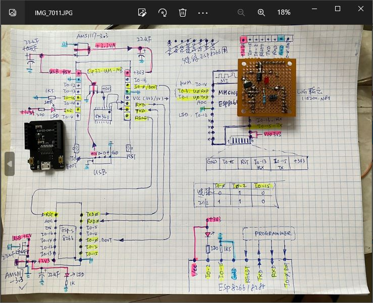
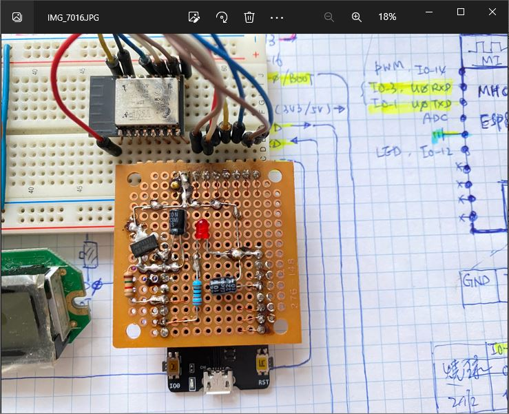
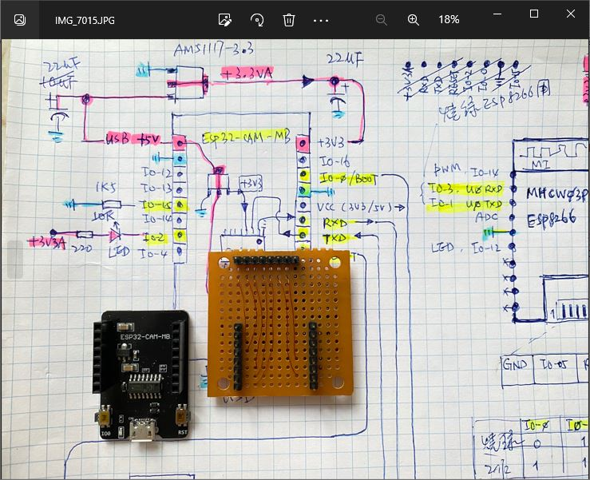
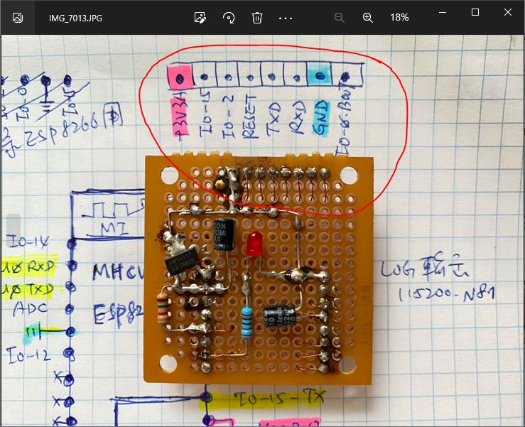
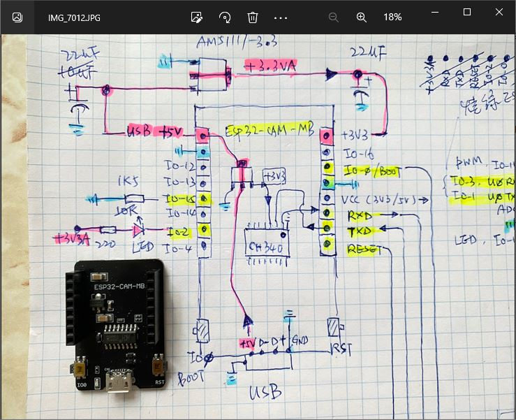
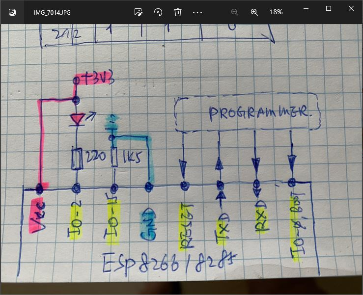

# ESP8266_ESP32-CAM-MB_blink_SOS_xiaolaba  
use ESP32-CAM-MB as the programmer for ESP8266 (ESP-S module is actually ESP8285)  

### hardware for tseting   
1. ESP-S (ESP8285 chip)    
2. ESP32-CAM-MB and  
3. adaptor own build  

overview of circuitry  
  

connected to target ESP-S  
  

adaptor and wiring
  



  


### software, p.bat
uses arduino IDE and esptool.py to burn code, no need manual reset to bootload mode

### software, b.bat, c.bat d.bat
uses esptool.exe to burn code, eed manual reset to bootload mode
hold IO-0/boot button, press RST button


 


esp8266 programmer and bootload circuitry  



```
Update by xiaolaba, 2019-MAR-02

// ESP8266_blink_SOS
// 2019-MAR-02

hardware : 
ESP-S (ESP8285 chip)
ESP32-CAM-MB and adaptor own build           


automatic bootload and burn code:
uses ESP32-CAM-MB and auto rest circuitry
 p.bat


manual RESET to burn code:
Burn rom image:
  hold GPIO-0 down, prese RESET, releasr RESET, release GPIO-0, MCU in flash mode
  open dosbox.bat, under command line, specifiy COM#
  c.bat : to clear flash
  b.bat : to burn in rom images
  
  example : c 12
  explain clear flash via COM PORT 12

Run this ESP8266, up on burn in is done
  power up, builtin LED will be flash SOS

optional:

Remark:

special note:
  PL2303 is not working for 26MHZ & boot time 74880 baud.
  CH340G / CP2102 is fine.
```
